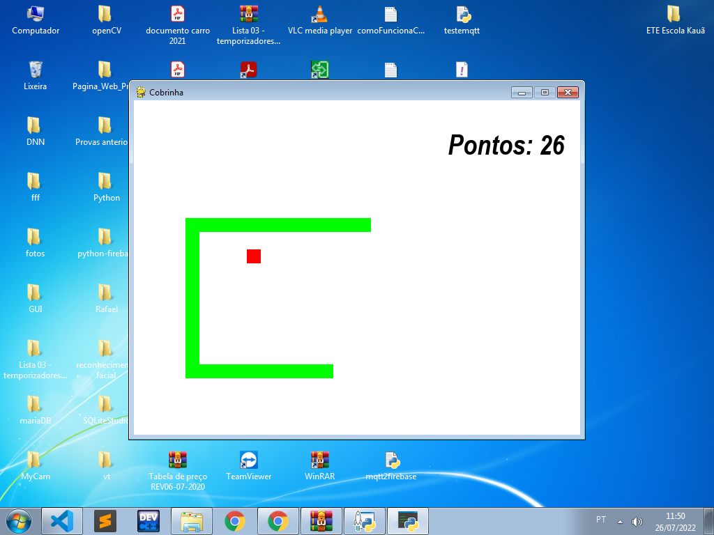

# Snake Game - Pygame




How to install the pygame:
```
pip install pygame
```

## 😄 Credits:<br>

The [freemusicarchive](https://freemusicarchive.org/music/) and [themushroomkingdom](https://themushroomkingdom.net/media/smw/wav) were the sites I got the sounds that was used in the game.
